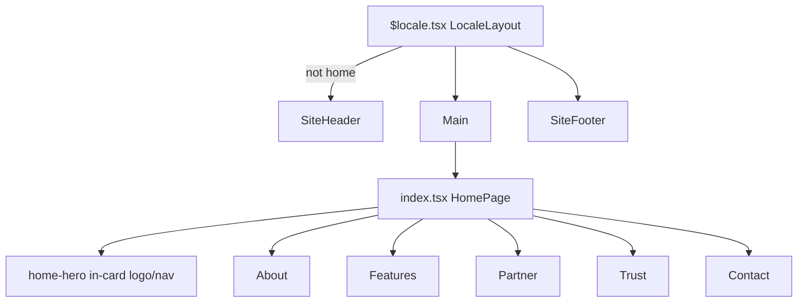

# Ai Labs home — GUIDELINES layout

## Decisions (locked)

- **Page:** [`src/routes/$locale/index.tsx`](src/routes/$locale/index.tsx) only
- **Chrome:** Hide [`SiteHeader`](src/components/chrome/site-header.tsx) on home; logo + nav live inside hero cards. Keep [`SiteFooter`](src/components/chrome/site-footer.tsx). Pillar routes keep the normal header.
- **Look:** Layout from [`GUIDELINES.md`](GUIDELINES.md); colors/type from Ai Labs ([`STYLES.md`](STYLES.md) — purple/graphite/lavender, Bricolage + DM Sans). Not FYNLO greens.
- **Copy:** Map [`CONTENT.md`](CONTENT.md) / proof from [`PRODUCT.md`](PRODUCT.md) into the five sections + shared `#contact` block. EN + ES.

## Content → section map

| GUIDELINES section | Ai Labs content |
| --- | --- |
| 1 Hero | Label + H1 (“Adapt, develop…”), sub, primary CTA → `#contact`, secondary → `#pillars`; bottom: avatar stack + “700+ Builders”; right card: pillar nav + hamburger sheet; media from `/carousel/*`; overlay metric card (e.g. events/partners signal) |
| 2 About | “About” label; community blurb + dual stats (`30+` Events, `8` Partners); bold right copy; full-width media + toast/play overlays |
| 3 Features (`#pillars`) | Centered “Three ways…”; CTA Talk to us; wide card: image + accordion (Academy / Agentic / Aperture, one open); 3 equal cards for pillar CTAs |
| 4 Partner | “Built on community” / founders; 2 large cards + 3 compact benefit rows |
| 5 Trust | Proof/testimonial-style row (stat / quote / portrait) |
| After | Shared contact section (`#contact`) from CONTENT.md — form UI only, no backend |

## Architecture

**Hide header on home:** In [`src/routes/$locale.tsx`](src/routes/$locale.tsx), detect exact `/$locale/` match (e.g. `useMatchRoute` / pathname with no child segment) and skip rendering `SiteHeader`. Skip-to-content link still available via hero or a minimal sr-only control on home.

**Do not wrap home in `MainCard`** — the GUIDELINES page is a soft multi-card stack with page gutters, not the dotted app-window shell. Pillar pages can keep `MainCard` later.

## Files to add / change

### Content layer
- Extend [`src/content/types.ts`](src/content/types.ts) with `HomeContent` (hero, about, features/pillars accordion + cards, partner, trust, contact form strings).
- Fill EN/ES in [`src/content/en.ts`](src/content/en.ts) and [`src/content/es.ts`](src/content/es.ts) from CONTENT.md (no cliché words banned in STYLES.md).

### Home section components (kebab-case under `src/components/home/`)
- `home-hero.tsx` — 2 equal tall cards; left: `SiteLogo` + secondary CTA, label/H1/body/primary CTA, proof footer; right: pillar links + 2-line menu opening a sheet/drawer (reuse mobile menu patterns from SiteHeader: locale switch, theme, contact); media + metric overlay
- `home-about.tsx`
- `home-features.tsx` — use existing [`accordion`](src/components/ui/accordion.tsx); style for large radius / borderless list inside the showcase card
- `home-partner.tsx`
- `home-trust.tsx`
- `home-contact.tsx` — form fields per CONTENT.md; submit no-ops / client validation only

Shared primitives as needed (small, local):
- Stadium CTA via `Button` + `rounded-full` / larger size classes (existing button sizes are compact — override with className for marketing pills)
- Large radius cards: `rounded-3xl` / `rounded-[2rem]`

### Route wiring
- [`src/routes/$locale/index.tsx`](src/routes/$locale/index.tsx) — compose sections from `getContent(locale).home`
- [`src/routes/$locale.tsx`](src/routes/$locale.tsx) — conditional header

### Assets
- Use existing [`public/carousel/*.webp`](public/carousel/) for media slots; no new photography required
- Avatars: simple initials circles or brand marks from `public/brand/` (no fake Unsplash people)

### Tokens (minimal)
- Only if needed: bump page max-width slightly for the dual-hero (CONTENT/STYLES use `72rem`; dual tall cards may need `~80–90rem` on home only via a local class — avoid global token churn)

## Motion (STYLES dial ~6)
- 2–3 intentional enters: hero cards fade/slide-in; section reveal on scroll (`IntersectionObserver` or CSS); accordion open. Honor `prefers-reduced-motion`.

## Out of scope
- Pillar page bodies (still `null`)
- Contact form backend
- Changing footer structure
- Matching FYNLO colors or inventing fake testimonials beyond CONTENT/PRODUCT proof
