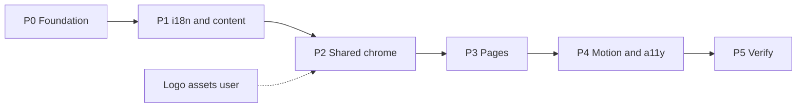

# Build Ai Labs site v1 (phased delivery)

Canonical plan file (workspace): [`.cursor/plans/build-ai-labs-site-v1.plan.md`](.cursor/plans/build-ai-labs-site-v1.plan.md)

On approval, this phased plan will be written there. Source docs: [PRODUCT.md](PRODUCT.md), [BRAND.md](BRAND.md), [STYLES.md](STYLES.md), [CONTENT.md](CONTENT.md).

## Goal

Full v1 marketing site on TanStack Start: `/en` + `/es`, Home + Academy + Agentic + Aperture, asymmetric hero + bento pillars, brand purple (Lila Ban overridden), form UI only.

## Confirmed decisions (carry forward)

- Locales: `/en/...`, `/es/...`; `/` redirects
- Hero: asymmetric left copy + right mark
- Pillars: asymmetric bento (not equal 3-col)
- Form: UI + success/error only
- Motion dial ~6; design-taste variance 8 / density 4
- Logo SVGs from you when ready; slot proceeds without them

## Phase dependency map

## Phased execution plan (handoff-ready)

### Phase 0 — Foundation (must land first)

- **Goal**: Brand tokens, fonts, button variants ready for every later UI.
- **Todos**: P0-001-tokens-fonts, P0-002-button-variants, P0-003-layout-primitives
- **Sequential**: P0-001 then P0-002/P0-003 (002 and 003 parallel after 001).
- **Touch**: [src/styles.css](src/styles.css), [src/components/ui/button.tsx](src/components/ui/button.tsx), new `section.tsx` / font packages via pnpm.

### Phase 1 — i18n shell and content (after Phase 0)

- **Goal**: Locale routing works; typed EN/ES content module mirrors CONTENT.md.
- **Todos**: P1-001-locale-routes, P1-002-content-modules, P1-003-root-redirect-meta
- **Parallelizable**: P1-001 and P1-002 in parallel; P1-003 after P1-001.
- **Touch**: `src/routes/$locale.tsx`, `src/routes/$locale/*.tsx` stubs, `src/routes/index.tsx`, `src/content/*`, [src/routes/__root.tsx](src/routes/__root.tsx).

### Phase 2 — Shared chrome (after Phase 1; logo optional parallel)

- **Goal**: Header, footer (stipple), proof, bento pieces, dark band, contact form UI.
- **Todos**: P2-001-logo-slot, P2-002-site-header-footer, P2-003-proof-bento-band, P2-004-contact-form-ui, P2-005-stipple-field
- **Parallelizable**: P2-001, P2-005, P2-003, P2-004 in parallel after P2-002 shell starts; header/footer can land first.
- **Depends on user**: SVG mark/lockup into `public/brand/` when available.

### Phase 3 — Pages (after Phase 2)

- **Goal**: Home + three pillars fully composed from content; contact interest prefill.
- **Todos**: P3-001-home-page, P3-002-academy-page, P3-003-agentic-page, P3-004-aperture-page
- **Parallelizable**: All four page todos in parallel once chrome + content exist.
- **Layout rules**: asymmetric hero; asymmetric pillar bento on home; no glow CTAs.

### Phase 4 — Motion and a11y (after Phase 3)

- **Goal**: Confident reveals/hovers; reduced-motion; skip link; bilingual 404.
- **Todos**: P4-001-reveal-motion, P4-002-sticky-header-states, P4-003-a11y-404
- **Parallelizable**: all three after Phase 3.

### Phase 5 — Verify (must land last)

- **Goal**: Typecheck, lint, manual bilingual QA.
- **Todos**: P5-001-typecheck-lint, P5-002-manual-qa
- **Sequential**: P5-001 then P5-002.

## Suggested parallel workstreams

- **Stream A (shell)**: Phase 0 → Phase 1 → Phase 2 header/footer → Phase 3 home
- **Stream B (content + forms)**: Phase 1 content modules → Phase 2 contact form + stipple → Phase 3 pillar pages
- **Stream C (identity)**: Logo SVGs whenever ready → P2-001 wire-up (non-blocking for A/B)

## Out of scope (v1)

Form backend, legal pages, `/about`, real social URLs, per-pillar colors, Framer magnetic/perpetual loops.

## Acceptance checklist

- `/` redirects; `/en` and `/es` correct copy
- Language switch preserves path
- Home + 3 pillars match CONTENT structure
- Form validates + success without backend
- Tokens/fonts match STYLES; purple as signal only
- Stipple in footer/washes only
- Reduced-motion respected; logo renders when provided
